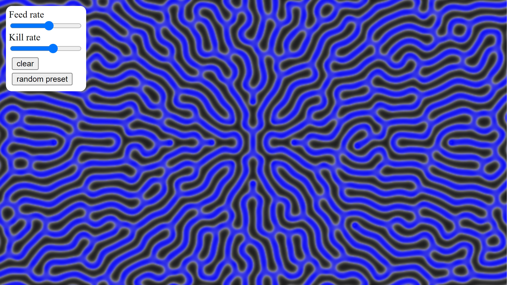

# Reaction Diffusion



## Try it here
https://callumferguson.github.io/reaction-diffusion/github-page/reaction-diffusion/

### Conway's Game of Life

This repository also contains and infinite grid game of life on and [older commit](https://github.com/CallumFerguson/reaction-diffusion/commits/game-of-life)

[Try it here](https://callumferguson.github.io/reaction-diffusion/github-page/game-of-life/)

## Setup

1. clone repo
```shell
git clone https://github.com/CallumFerguson/reaction-diffusion
```

2. cd into hotreloader
```shell
cd reaction-diffusion/hotreloader
```

3. install npm dependencies
```shell
npm install
```

4. start the hotreloader
    - this will run wasm-pack and host a server at http://127.0.0.1:3000
    - it may take a minute the first time it compiles
    - if anything changes in src, it will recompile and refresh the webpage
```shell
npm start
```
